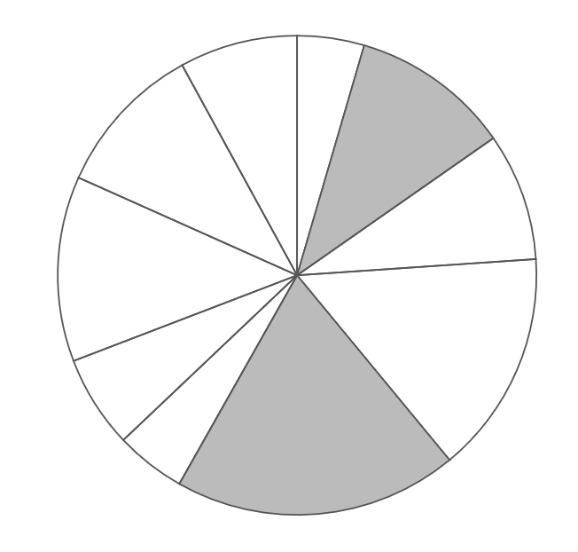

Assignment 3 - Replicating a Classic Experiment  
===

**Ashish Gurung 
Aaron Haim 
Stephanie Strom **

Experiment Description
---

For our experiment, we compared bar charts, pie charts, and line charts. We added the additional experimental condition of comparing static charts to charts that transition upon opening. Each survey consisted of 24 trials, each of the six chart types appeared four times in random order. Each chart was a visualization of 10 random data points. For the transitioning charts, the charts first appear with all data points as equal and then transition to their random value. We thought this was an interesting question to see if there was any difference in accuracy with a transition on opening. Pictured below are screenshots of the six different charts.

### Bar Chart

### Pie Chart

### Line Chart

### Bar Chart with Transition

### Pie Chart with Transition

### Line Chart with Transition

Experiment Results
---
 Here are the Hypothesis we wanted to test:
  * Does line chart facilitate the interpretation of data more effectively than bar and pie charts?
  * Does the use of animation improve the user performance while interpreting data?

Finally we analyzed the charts using bootstrapped 96\% confidence intervals and the chart from the analysis is provided below:

Analyzing the chart we can see that for the line and bar chart the performance of the users' increased with the animate condition but it regressed further in the pie chart condition. So it does can enhance performance for charts where the users already perform at a higher level. Analyzing line vs. line with animation is indicative of improving performance but the difference is not significant. In the contenxt of this experiment, the static line chart in is not a good alternative to bar charts however if we must utilize line charts for some reason then animating them will make the performance of users using bar, bar with animation and line with animation comparable. The chart also indicates that although there isn't significant difference between line, pie and pie with animation, using animation makes line chart significantly better than pie charts and pie chart with animations.

### Technical Achievements
- We deployed our experiment online and it can be accessed through the following link.
[Link to the experiment](https://internal.assistments.org/LiveChart/experimentindex)
The webpage is hosted on a server at WPI. 
We are using Spring, the pages are hosted using JSP, the API is RESTful and the data is stored ina Postgres DB.

### Design Achievements
- **Transitions:** We used transitions on the bar, pie, and line charts as a unique condition to test. This also provided a coding challenge in d3.

### References
- [https://www.d3-graph-gallery.com/graph/pie_basic.html](https://www.d3-graph-gallery.com/graph/pie_basic.html)
- [https://www.tutorialsteacher.com/d3js/create-pie-chart-using-d3js](https://www.tutorialsteacher.com/d3js/create-pie-chart-using-d3js)
- [https://bl.ocks.org/mbostock/1346410](https://bl.ocks.org/mbostock/1346410)
- [https://bl.ocks.org/gordlea/27370d1eea8464b04538e6d8ced39e89](https://bl.ocks.org/gordlea/27370d1eea8464b04538e6d8ced39e89)
- [https://jsfiddle.net/elangobharathi/Lqbcye5u/5/](https://jsfiddle.net/elangobharathi/Lqbcye5u/5/)
- [https://www.d3-graph-gallery.com/graph/line_basic.html](https://www.d3-graph-gallery.com/graph/line_basic.html)
- [https://www.d3-graph-gallery.com/graph/line_change_data.html](https://www.d3-graph-gallery.com/graph/line_change_data.html)
- [https://www.tutorialsteacher.com/d3js/create-bar-chart-using-d3js](https://www.tutorialsteacher.com/d3js/create-bar-chart-using-d3js)
- [https://www.d3-graph-gallery.com/graph/barplot_basic.html](https://www.d3-graph-gallery.com/graph/barplot_basic.html)
