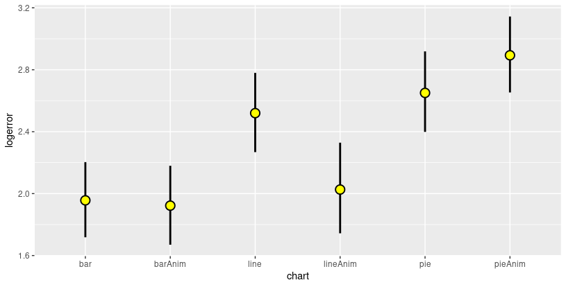

Assignment 3 - Replicating a Classic Experiment  
===

Requirements
---

In this replication(-esque) exploration what we conducted around the **Cleveland & McGill paper** we decided to explore replicating the same experiment using **bar charts, bar charts with animation, line charts, line charts with animation, pie charts and pie charts with animation**. First we wanted to see if the introduction of animation would make a difference in the ability of the user to interpret the data. Does it enhance the users ability **No it doesn't**; we will talk about this when we go over the results of this experiment.

- Why did we use the different types of visualizations:
    - We used the bar and pie chart in order to stay true to the orignal experiments
    - We wanted to see if line-chart would be able to out perform barcharts as the line between the dots provides a visual element that might help the user interpret the data more effectively
    - We wanted to animate the charts as we wanted to see if the use of animation has an effect on the user performance

- Here are the Hypothesis we wanted to test:
    - Does line chart facilitate the interpretation of data more effectively than bar and pie charts?
    - Does the use of animation improve the user performance while interpreting data?

We had 34 participants who analyzed 24 charts in total. Each user was asked to analyze 6 types of charts with 4 charts of each type. The charts were generated in random order to avoid any selection effects and the values in the chart were also randomly generated. We did worry about the introduction of repeated measure bias due to the nature of this survey. Unfortunately the exploration of the introduction of repeated measure bias was outside the scope of this work. Hence we decided to rely on the likelihood of the repeated measure bias getting mitigated by the randomization.

The summary table below shows the summative information of the 6 charts. As you can observe the Barchart with animation was the best performer and the piechart with animation was the worst. We used python for this portion of the analysis as we were more comfortable with preprocessing the data using Python.

You can see the three charts we showed the users below:

**For the animation condition we start all the charts at 50% and animate it to the generated values. For Pie chart we divide all the sections(arcs) equally.**

Finally we analyzed the charts using bootstrapped 96\% confidence intervals and the chart from the analysis is provided below:

Analyzing the chart we can see that for the line and bar chart the performance of the users' increased with the animate condition but it regressed further in the pie chart condition. So it does can enhance performance for charts where the users already perform at a higher level. Analyzing line vs. line with animation is indicative of improving performance but the difference is not significant. In the contenxt of this experiment, the static line chart in is not a good alternative to bar charts however if we must utilize line charts for some reason then animating them will make the performance of users using bar, bar with animation and line with animation comparable. The chart also indicates that although there isn't significant difference between line, pie and pie with animation, using animation makes line chart significantly better than pie charts and pie chart with animations.

We deployed our experiment online and it can be accessed through the following link.
[Link to the experiment](https://internal.assistments.org/LiveChart/experimentindex)

Design achievements:
===
Inorder to explore the effectiveness of using cleaner chart design while remaining within the parameters of the orignal study we tweaked aspects of the charts. We introduced different shades of greys and black to highlight the bars. We were hoping that the users would have an easier time working with the new color scheme of the charts. We also introduced Animation inorder to enhance the user experience and see how the animation element influences the users interpretation of the data.

Technical achievements:
===
We setup the experiment to work on a full stack project. Our data is stored in a Postgres database and we setup a RESTful api to handle the data request in Spring and the web pages are hosted using jsp pages.  
